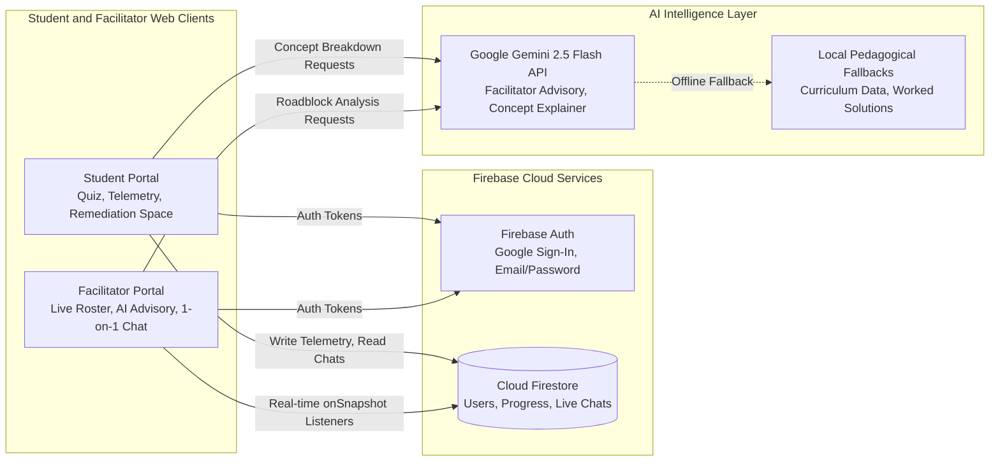
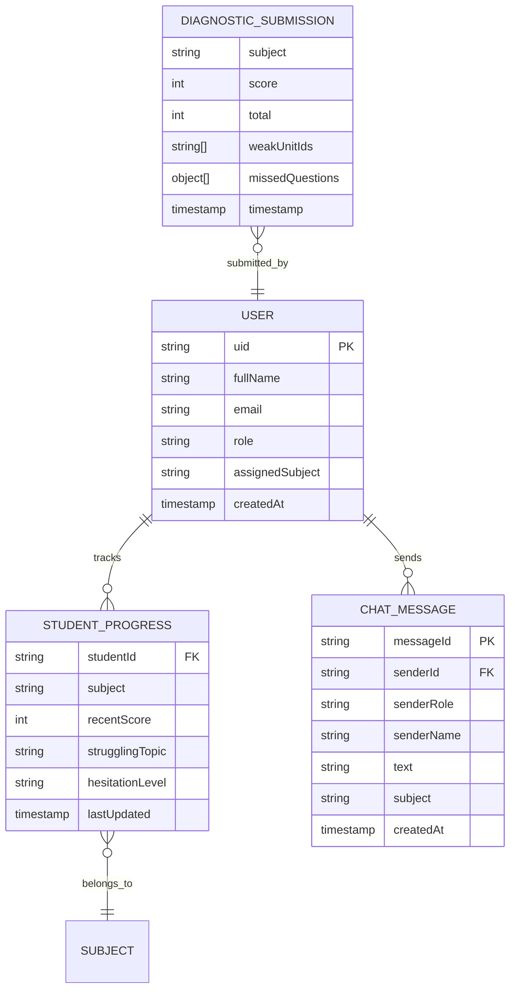

# Architecture

[Back to README](../README.md)

## System Diagram

## Request Walkthrough

Here is the exact end-to-end flow when a student takes an assessment and receives personalized intervention:

1. **Student Begins Diagnostic**: The student opens the 10-question Chemistry or Economics diagnostic quiz. As they view each question, a local timer measures idle seconds. If the student spends more than 7 seconds on a single question without selecting an option, an in-memory hesitation event triggers.
2. **Telemetry Logging**: The client immediately calls `syncStudentProgress` via Firestore, updating the document `progress/{studentUid}_{subject}` with `hesitationLevel: 'high'`, recent score trends, and active topic.
3. **Assessment Evaluation**: Upon submission, `submitDiagnostic` evaluates each response against the curriculum concept nodes, identifies missed question clusters, calculates topic weights, and maps the student to priority remediation packages in `PersonalizedLearningPage`.
4. **Live Facilitator Alert**: The teacher portal, which maintains an active `onSnapshot()` subscription to `users` and `progress`, updates instantly without a page refresh. The student card displays a warning badge indicating high hesitation.
5. **AI Roadblock Analysis**: The teacher clicks "Analyze Student Roadblock". The client formats a prompt containing the student's score, specific question traps, and hesitation signals, and sends it to the Google Gemini API.
6. **4-Line Advisory Generation**: Gemini generates a structured 4-line diagnostic (2 lines describing the root conceptual cause, and 2 lines providing actionable teaching steps).
7. **Intervention via Chat**: The teacher clicks "Copy Action Plan to 1-on-1 Chat", which pastes the recommendations into the private message composer. Once sent, the message is written to `personalized_chats/{studentUid}_{subject}/messages` and appears on the student's screen in real time.

## Components

| Component | Responsibility | Tech | Code location |
|---|---|---|---|
| Student Portal | Diagnostic assessment runner, hesitation tracking, sequenced knowledge graph, slide viewer, and remediation space | React 19, Lucide Icons, Tailwind CSS | `frontend/src/components/student/` |
| Facilitator Portal | Real-time student roster, cohort health indicators, Gemini-powered advisory engine, and 1-on-1 chat | React 19, Lucide Icons | `frontend/src/components/facilitator/` |
| Application Context | Global session state, user persona, active subject selection, modal management, and toast notifications | React Context API | `frontend/src/context/AppContext.tsx` |
| Firestore Service | Real-time data synchronization for user accounts, telemetry, progress documents, and chat messages | Firebase SDK v12 | `frontend/src/services/firestoreService.ts` |
| AI Advisory Service | Builds targeted prompts and calls Gemini API for teacher 4-line diagnostic advice | @google/genai SDK | `frontend/src/services/aiAdvisoryService.ts` |
| Concept Explainer Service | Generates visual analogies, 3-step worked examples, and checkpoint questions for student remediation | @google/genai SDK | `frontend/src/services/conceptExplainerService.ts` |
| Opportunities Service | Matches student focus areas to real-world STEM and Economics competitions | @google/genai SDK | `frontend/src/services/opportunitiesGeminiService.ts` |

## Data Model

| Entity | Key fields | Notes |
|---|---|---|
| User | `uid, fullName, email, role, assignedSubject, createdAt` | Supports both student and facilitator roles, created on sign-up in `users/{uid}` |
| StudentProgress | `studentId, subject, recentScore, strugglingTopic, hesitationLevel, lastUpdated` | Stored in `progress/{studentUid}_{subject}`, drives live facilitator dashboard badges |
| ChatMessage | `messageId, senderId, senderRole, senderName, text, subject, createdAt` | Stored in subcollection `personalized_chats/{studentUid}_{subject}/messages` |
| DiagnosticSubmission | `score, total, weakUnitIds, missedQuestions, timestamp` | Holds completed diagnostic evaluations and learning plan metadata in app context |
| FocusAreaPackage | `id, topic, unit, customSlideDeck, studyGuide, practiceExercises` | Comprehensive curriculum study packages with slides, analogies, and exercises |

## Key APIs

| Service | Method / Event | Purpose | Auth |
|---|---|---|---|
| Firebase Auth | `signInWithPopup` / `signInWithEmailAndPassword` | Authenticates users and creates or retrieves persistent profile | Public / User Credential |
| Cloud Firestore | `onSnapshot(collection("users"))` | Real-time listener for the teacher roster, auto-updating on new signups | Facilitator Role |
| Cloud Firestore | `onSnapshot(collection("progress"))` | Real-time listener for student diagnostic scores and hesitation levels | Facilitator Role |
| Cloud Firestore | `onSnapshot(collection("messages"))` | Real-time 2-way chat subscription between student and subject teacher | Authenticated Users |
| Cloud Firestore | `setDoc` / `addDoc` | Writes user profiles, progress updates, and chat messages | Authenticated Users |
| Google Gemini | `ai.models.generateContent` | Generates 4-line facilitator advisory, concept explanations, and competitions | Client API Key (`VITE_GEMINI_API_KEY`) |

## Tech Stack

| Layer | Choice | Why this over alternatives |
|---|---|---|
| Frontend | React 19 + TypeScript + Vite | React 19 gives us high-performance UI rendering, TypeScript prevents typing errors across complex curriculum objects, and Vite delivers sub-second hot reload during development. |
| Styling | Tailwind CSS 4 | Allows us to build custom, accessible, and responsive user interfaces with consistent design tokens without writing thousands of lines of ad-hoc CSS. |
| Database | Google Cloud Firestore | Provides real-time synchronization out of the box through `onSnapshot()`. This eliminates the need to build a custom WebSocket server for teacher rosters and student chats. |
| Authentication | Firebase Auth | Handles secure Google Sign-In and email/password flows with minimal boilerplate, letting us focus on the core educational intelligence features. |
| AI Integration | Google Gemini 2.5 Flash via @google/genai | Extremely fast response latency (under 1.5 seconds) which is essential for real-time concept breakdown while a student is actively studying. |
| Hosting | Vite Static Preview / Local Node Server | Zero-config static output bundle that can be hosted on any static cloud provider or run locally with `npm run dev`. |

## Data Sources

| Dataset | Source and licence | Real or synthetic | Used for |
|---|---|---|---|
| Chemistry Diagnostic Questions | Curated by our team based on Grade 9-10 CBSE, ICSE, and IGCSE chemistry standards | Real pedagogical questions | 10-question diagnostic quiz covering matter, bonding, reactions, and kinetics |
| Economics Diagnostic Questions | Curated by our team based on Grade 9-10 introductory microeconomics curricula | Real pedagogical questions | 10-question diagnostic quiz covering scarcity, opportunity cost, supply, demand, and equilibrium |
| Verified Competitions and Olympiads | Curated list of legitimate youth competitions (Chemistry Olympiad, Wharton High School Investment, Regeneron ISEF, etc.) | Real public opportunities | Opportunities Hub recommendations for high-achieving or motivated students |
| Curriculum Dependency Nodes | Designed based on educational prerequisite sequencing models | Real structured sequence | Concept Knowledge Graph rendering and adaptive learning path generation |
